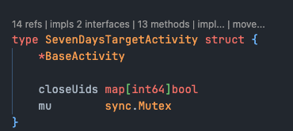

# VSCode配置

> 由于 Jetbrain 家的 IDEs 在我的 Mac M2 pro 上总是出渲染 bug, 一直查不到什么原因, 加上不太想用盗版了, 因此再一次尝试使用 VSCode 代替

开发需求:
- python
- go
- 前端(vue)
- 偶尔可能有些小需求 lua/squirrel

## 基建

### 基础的几个插件
- 语言包 - 没啥好说的
- 主题包 - 试了几个最后选择 Github Theme
- Keybindings - IntelliJ IDEA Keybindings, 更容易从 JB 过渡, 虽然还是有一堆要改的, 因为我在 JB 里也改了不少热键

### git
- ~~GitLens~~ - 被称为必备的 git 插件, 功能强大. 不过简单的 git 操作我更喜欢在终端用 lazygit
- ~~Git Graph~~ - 单独的可视化插件, GitLens 也有这个功能

> VSCdoe 1.91 版本实验性功能已经支持 git graph 了

### 开发辅助
- Project Manager - 在侧边栏加上了一个项目目录, 可以快速切换项目, 其实也没啥大用, 聊胜于无
- Path Autocomplete - 自动补全路径, 补全相对路径很方便, 绝对路径貌似因为权限的问题无法识别
- Markdown All in One - 简单的文档就在 vscode 编辑, 复杂点的上 yn
- Todo Tree - 把代码里的 TODO/FIXME 等标志在侧栏的树状图中管理
- ~~Excel Viewer - 使 VSCode 支持 Excel 文件查看/编辑~~
- 草稿本 -  提供类似与 JB 家的临时文件功能
- Make support and task provider - 将 makefile 的 快捷指令, 就可以不用开终端去调用了

--- 2024-08-23 更新 ---
> 不再推荐 Excel Viewer，开发者很傻逼地加了广告，还无法关闭，替品：Office Viewer(M karkdown Editor)
- Office Viewer(Markdown Editor) - 支持 office/pdf 等众多格式的预览，貌似是国人开发的，开源免费无广告


> Excel Viewer 容易误触编辑, 如果全局有自动保存配置的话就容易增加不必要的改动信息, 可以单独将 Excel 文件的自动保存关闭
> ```json
> {
>     "[excel]": {
>         "files.autoSave": "off"
>     },
> }
> ```
- Github Actions - github actions 辅助插件
- Remote 套件 - windows 下用的多, 用来在 wsl 上开发, remote 套件是 VSCode 生态比 Jetbrain 生态最有优势的特性之一

### AI
- github copilot - 收费, pass
- 通义灵码 - 阿里家的, JB 里用的这个, 勉勉强强吧, 但是在 VSCode 里它会给 Quick Fix 上下文菜单里加入 "使用通义灵码修复" 的项, 并且放到了第一个. 这个功能很鸡肋, 又严重影响调用其他 Quick Fix 功能的效率, 还找不到地方关闭, 所以 pass. (其他 AI 也会加入 Quick Fix, 但是没放第一位, 所以还好)
- 豆包 MarsCode - 字节的, 看到阮一峰推荐这个, 说和 github copilot 差不多水平了, 就想试试, 结果它在补全预览的时候拦截了 Esc 的行为, 严重影响 vim 的功能, 所以直接 pass.
- CodeGeeX - 清华大学的, 算是除了 github copilot 外我用过的体验最好的了

### ~~vim~~
> vim 插件貌似有些性能问题，经社区推荐使用 vscode-neovim 代替

自从用了 vim 之后, 编辑器提供的编辑相关的热键都可以忽略了, 甚至非编辑相关的功能也可以绑到 vim 映射里

```json
{
    // vim 复制操作很多, 最好和系统剪贴板隔离开来, 避免污染系统剪贴板
    "vim.useSystemClipboard": false,
    // 使用 neovim
    "vim.enableNeovim": true,
    // easymotion 插件
    "vim.easymotion": true,
    // 使用相对行数
    "vim.smartRelativeLine": true,
    // 搜索相关的配置
    "vim.hlsearch": true,
    "vim.incsearch": true,
    // leader 键
    "vim.leader": "`",
    // 键绑定, 可以支持按键映射, 也可以调用 vscode 的功能
    // 功能 id 可以从 vscode 的热键配置里获取
    "vim.normalModeKeyBindingsNonRecursive": [],
}
```

### vscode-neovim
neovim 插件的原理是后台运行一个 neovim 实例，与 vscode 共享 buffer，使在 normal 模式下能够获得满血的 nvim 体验，而图形渲染和 insert 模式则由 vscode 提供，这样能够同时享受到 nvim 和 vscode 的插件生态

nvim 配置我直接用的 [lazyvim](https://www.lazyvim.org/)，省心，而且其本身支持 vscode 模式，在终端和 vscode 里都表现出色。

额外增加了一些 vscode 模式下的专属热键，主要用于调用 vscode 的功能
```lua
-- keymaps.lua
-- vscode 模式专属
if vim.g.vscode then
  vim.g.mapleader = "`"

  local opts = {
    noremap = true,
    silent = true,
  }

  vim.api.nvim_set_keymap("n", "<leader>h", ":call VSCodeNotify('workbench.action.navigateLeft')<CR>", opts)
  vim.api.nvim_set_keymap("n", "<leader>l", ":call VSCodeNotify('workbench.action.navigateRight')<CR>", opts)
  vim.api.nvim_set_keymap("n", "<leader>j", ":call VSCodeNotify('workbench.action.navigateDown')<CR>", opts)
  vim.api.nvim_set_keymap("n", "<leader>k", ":call VSCodeNotify('workbench.action.navigateUp')<CR>", opts)
  vim.api.nvim_set_keymap("n", "<leader>m", ":call VSCodeNotify('workbench.action.moveEditorToNextGroup')<CR>", opts)
  vim.api.nvim_set_keymap(
    "n",
    "<leader>M",
    ":call VSCodeNotify('workbench.action.moveEditorToPreviousGroup')<CR>",
    opts
  )
  vim.api.nvim_set_keymap("n", "<leader>r", ":call VSCodeNotify('editor.action.rename')<CR>", opts)
  vim.api.nvim_set_keymap(
    "n",
    "<leader>f",
    ":call VSCodeNotify('workbench.action.toggleMaximizeEditorGroup')<CR>",
    opts
  )
  vim.api.nvim_set_keymap("n", "gr", ":call VSCodeNotify('workbench.action.openRecent')<CR>", opts)
  vim.api.nvim_set_keymap("n", "gb", ":call VSCodeNotify('git.checkout')<CR>", opts)
  vim.api.nvim_set_keymap("n", "gp", ":call VSCodeNotify('git.pull')<CR>", opts)
  vim.api.nvim_set_keymap("n", "gP", ":call VSCodeNotify('git.push')<CR>", opts)
  vim.api.nvim_set_keymap("n", "gn", ":call VSCodeNotify('editor.action.marker.next')<CR>", opts)
  vim.api.nvim_set_keymap("n", "gs", ":call VSCodeNotify('workbench.action.quickOpen')<CR>", opts)
  vim.api.nvim_set_keymap("n", "zc", ":call VSCodeNotify('editor.fold')<CR>", opts)
  vim.api.nvim_set_keymap("n", "zo", ":call VSCodeNotify('editor.unfold')<CR>", opts)
  vim.api.nvim_set_keymap("v", "r", ":call VSCodeNotify('editor.action.refactor')<CR>", opts)
end
```

有些热键也可以直接用 vscode 的
```json
[
    {
        // vim visual 模式下, python 代码 s 触发 surround-python 插件
        "key": "s",
        "command": "surround-python.with",
        "when": "editorTextFocus && editorLangId == 'python' && (neovim.mode == 'visual' || neovim.mode == 'visualline' || neovim.mode == 'visualblock')"
    },
    // 大写HJKL导航需要使用 shift 组合键（这里大小写不区分）
    {
        "key": "shift+l",
        "command": "workbench.action.navigateForward",
        "when": "editorTextFocus && neovim.mode == 'normal'",
    },
    {
        "key": "shift+h",
        "command": "workbench.action.navigateBack",
        "when": "editorTextFocus && neovim.mode == 'normal'",
    },
    {
        "key": "shift+j",
        "command": "workbench.action.nextEditorInGroup",
        "when": "editorTextFocus && neovim.mode == 'normal'"
    },
    {
        "key": "shift+k",
        "command": "workbench.action.previousEditorInGroup",
        "when": "editorTextFocus && neovim.mode == 'normal'"
    },
]
```


## Python

动态语言的插件有点多

### 语言插件

- 语言插件 `Python` 
- 语言服务 `Pylanc`
- debugger `Python Debugger`

相关配置

```json
{
    "python.languageServer": "Pylance",
    // 启用类型检查
    "python.analysis.typeCheckingMode": "basic",
    // 使用自动完成器键入库时自动添加 import
    "python.analysis.autoImportCompletions": true,
    // 默认只会索引第三方库的第一层
    "python.analysis.packageIndexDepths": [
        {
            "name": "",
            "depth": 5
        },
    ],
    // 索引文件数量限制, -1 取消限制
    "python.analysis.userFileIndexingLimit": -1,
}
```

> 有点蛋疼的是第三方库的索引很多时候不完整, 常常要手动导入后才会被索引到, 暂时不知如何解决

### Linter&Formatter

然后就是代码格式化了, 包括 PEP8 格式化, 和导入优化 (删除未使用的导入), 此前可能需要几个插件来实现
- Flake8
- Black
- isort
- ...

但是现在有了更好的选择
- ruff - 使用 rust 写的高性能的 python linter 和 formatter

相关配置:
```json
{
    "[python]": {
        // 保存时自动格式化
        "editor.formatOnSave": true,
        // 使用 ruff 作为 formatter
        "editor.defaultFormatter": "charliermarsh.ruff",
        // 保存时的动作
        "editor.codeActionsOnSave": {
            // 优化导入排序
            "source.organizeImports": "explicit",
            // 删除未使用的导入
            "source.unusedImports": "explicit",
            // 尝试 fixAll
            "source.fixAll": "explicit"
        }
    },
    // ruff 全局配置, 此外还可以读取 project.toml 文件针对项目单独配置
    "ruff.configuration": "$HOME/.config/ruff/ruff.toml",
}
```

### 其他辅助插件

- autoDocstring - 自动生成标准格式化的 docstring
- ~~Pip Manager~~ - 在侧栏管理 pip 包, 但是 uv 创建的虚拟环境是没有 pip 的, 所以不太兼容
- Python Indent - 当输入 `Enter` 换行时可根据上下文设置更合适的缩进, 使用 vim-o 新增行时不适用
- Jinjia2 Snippet Kit - 给 html 文件增加一些 jinja2 的代码片段, 不如 pycharm 的功能, 聊胜于无吧
- Python Environment Manager - 新出的虚拟环境管理器, 完美替代掉 Pip Manager, 不过依旧不支持 uv
> 有一个骚操作, 把 pip 安装回去, uv pip install pip, 这时插件就可以正常使用 pip 了 (或者想办法把 pip 映射为 uv pip)
- vscode-surround-python - 提供诸如 `try-except`, `with` 等代码模板支持

> python 项目会自动加载根目录下的 .env 文件里的环境变量, 在某些情况下会导致意想不到的 bug, 因此将它关掉: 
> ```json
> {
>     "python.envFile": "",
> }
> ```

> 编辑类的功能比如 vscode-surround-python 我希望通过 vim 来触发, 但是 vim 的 keybinding 不支持 when 条件, 所以这种需要写在 vscode 的 keybindings.json 里:
> ```json
> {
>   // vim visual 模式下, python 代码 s 触发 surround-python 插件
>   "key": "s",
>   "command": "surround-python.with",
>   "when": "editorTextFocus && editorLangId == 'python' && (vim.mode == 'Visual' || vim.mode == 'VisualLine' || vim.mode == 'VisualBlock')"
> }
> ```

## Go
相比 Python, Go 更开箱即用些, 装上 Go 插件, 设置一下 GOPATH 基本上就好了
```json
{
    "go.gopath": "$HOME/go"
}
```

--- 2024-08-16 更新 ---
- Tooltitude for Go (GoLang): 在编辑器内提供一些快捷操作，重点：提供了类似 Goland 的 <结构体实现了哪些接口> 的提示和快速跳转



## Javascript/Typescript

前端这边也有很多插件

### 语言插件
- Vue-Official
- Tailwind CSS IntelliSense

相关配置:
```json
{
    "[vue]": {
        // 优化 tailwindcss 的提示
        "editor.quickSuggestions": {
            "other": "on",
            "strings": "on"
        },
        "editor.defaultFormatter": "Vue.volar",
        "editor.formatOnSave": true,
    },
}
```

### Linter&Formatter
- ESLint - 无需解释
- Prettier - 同上

### Debuger
- Microsoft Edge Tools for VS Code - 我一般用 Edge 浏览器, 其他主流浏览器也有对应的插件

### 辅助开发
- Vite - 打开项目自动启动 vite  开发服务
- element-plus-doc - element-plus 库的智能提示+悬停文档

## 其他语言支持
- ~~Protobuf support - protobuf 语法支持~~ 不支持跳转，使用替品
- vscode-proto3 - protobuf3 语法高亮，补全和跳转